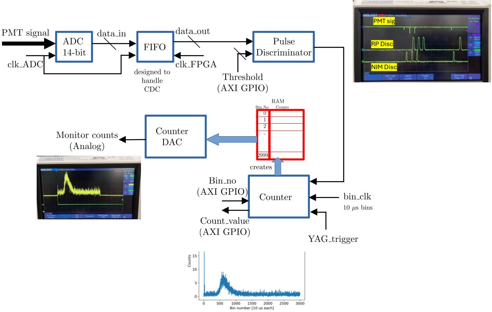

# Pulse-Counter
This module implements a photon signal discrimination and counting hardware on a Red Pitaya board for a time-of-flight like measurement. 
A C-code software is implemented to interface with the hardware that returns number of counts as a function of bin index. The counting is performed in time bins of width 10 us. A brief description of the implementation is described next.

A rising edge of a trigger signal (at 10 Hz) initiates a counting sequence. A 100 kHz clock signal, internally generated and referred to as the bin-clock, is used to count and index bins. Within each bin the number of input pulses received are counted using a 250 MHz clock (derived from the ADC clock). The counting is continuously performed till the bin number reaches 3000 (relevant in the experiment) and the data is temporarily stored in a memory implemented within the fabric. On the falling edge of the trigger signal, the software which directly interfaces with AXI GPIO ports, can be used to read-out the counts vs bin-index data. An analog output monitor of the counter data is also generated at the DAC output port of the Red Pitaya.

The FPGA logic is designed to handle clock domain crossing. A clock domain crossing, in this context, occurs when the adc read rate and the FPGA processing clock rates are different. A simple FIFO, designed solely for this application, capable of transferring data across clock domain crossing is integrated into the design. The FIFO does not have an external readable full/empty port, and is designed to work with continuous stream of incoming data.

In the current design, the ADC clock is operating at 125 MHz (max achievable in the Red Pitaya 125-14 board), and the fpga logic is deliberately run at a different clock to demonstrate the robust implementation of the system. To demonstrate the max clock speed at which the FPGA logic still meets the  timing constraints, the FPGA is successfully operated at 250 MHz.
The FPGA could also be operated at a slower rate, in which case the FIFO will buffer the data transfer between the ADC and the FPGA logic stages. However this would normally require implementing a deeper FIFO to ensure no incoming data in the duration of interest is missed.

A minimal schematic of this design is shown here, along with test result obtained for each module.

(The NIM disc signal is derived from a NIM discriminator and pulse converter unit, displayed here for comparision with the RP based discriminator.)

